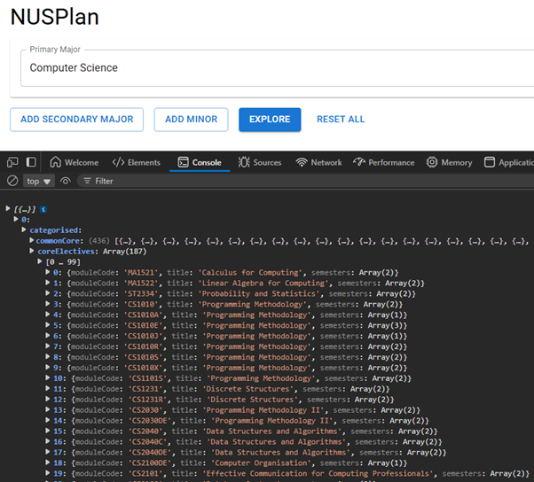

****

# **Orbital \- Milestone 1**

# **Members:**

* Name: Leong Jia Jing  
  * Faculty: Faculty of Science  
  * Major: Life Sciences  
  * Year: 1

* Name: Matthias Yim Wai Meng  
  * Faculty: School of Computing  
  * Major: Computer Science  
  * Year: 1

# **Proposed Level of Achievement: Gemini**

# **Project Scope:** 

A centralized academic planner for NUS FoS and SoC students, that generates and validates multi-program study plans with optimised double-counting.

# **Motivation** 

During NUS Open House, a friend kept asking about double counting and where to find information on module mappings. This brought back memories of the tedious and time-consuming work required when planning an academic journey.

Currently, module planning is a complex and fragmented process because:

* Different faculties and programs list their requirements on separate websites, making consolidation difficult.

* Double-counting rules are not easily accessible, requiring students to manually check multiple sources.

* There is no centralized system to explore second majors, minors, and their impact on study plans efficiently.

This issue is especially critical for Year 1 students, who need to make essential academic decisions early. However, they are also bombarded with the excitement of university life \- making friends, joining CCAs, and adapting to a new environment \- leaving little time to focus on planning. By the time they start considering their options, they may realize too late that:

* Some second majors and minors require early planning, making them difficult or even impossible to pursue later.

* They missed double-counting opportunities, which could have reduced their total workload.

* The lack of a centralized planning system made it hard to track how different academic choices impact their study plan.

Seeing how challenging this process is, it became clear that many students face similar struggles. A solution is needed to make academic planning seamless and intuitive, ensuring that students can navigate their options with clarity and confidence.

# **Aim** 

This project aims to streamline academic planning by creating a centralized, automated system that eliminates confusion, optimizes double-counting, and provides students with an effortless way to structure their study plan before it’s too late.

#### We hope to develop a centralized academic planning system that:

* Consolidate requirement data across majors, second majors, and minors in SoC and FoS.

* Provide a visual interface for selecting up to 5 academic programs and understanding how they interact.

* Automatically validate and optimize requirements and double-counting.

* Help students build valid, semester-wise roadmaps with pre-requisite and semester validation.

# **User Stories**

1. **(Core) As a first-year student,** I want to explore different second major and minor combinations so that I can optimize my study plan and avoid missing opportunities.

2. **(Core) As a student considering a second major,** I want to see the exact modules required and which ones can be double-counted so that I can make an informed decision.

3. **(Core) As a student,**  I want the system to validate that my plan fulfills graduation rules.

4. **(Core) As a student who wants to maximize my AUs,** I want the system to identify which modules can be double-counted across different programs so that I can take the most efficient path toward completion.

5. **(Extension) As a student who wants a structured plan,**  I want to arrange my modules into a semester timetable that respects module prerequisites and preclusions.

6. **(Extension) As a student who revisits my academic plan frequently,** I want my study plan to be saved automatically so that I don’t have to re-enter my selections every time.

# **Features**

## **Core Features (Milestone 1 & 2\)**

1. ### **AP Explorer (Milestone 1\)**

This is the entry point of the planning tool and the only feature prototyped in Milestone 1\. AP Explorer lets users select up to 5 academic programs:

* 1 Primary Major  
* 1 Second Major (optional)  
* Up to 3 Minors (optional)

Based on the selected programs, the system generates a module pool, which is a list of all modules that could be used to fulfil the requirements of those programs.

The module pool is grouped by requirement type, including:

* Common Core (university/faculty-wide requirement, only SoC data is curated)  
* Core Essentials (compulsory modules)  
* Core Electives (electives modules of program)  
* Core Others (other requirements)  
* Core Specials (specialisation \- not in database yet)  
* Unrestricted Electives (not implemented, depends on modules user chose)

Limitations in Milestone 1:

* It does not yet check for overlap across programs (e.g., the same module appearing in both a major and a minor).  
* It does not validate rules like minimum/maximum AU, double-counting caps, or variant groups.  
* It treats all retrieved modules as equally valid, even if they duplicate or contradict across programs.

2. ### **AP Validator *(in progress for Milestone 2\)***

This feature validates the student's selected modules to ensure they meet **program requirements** for all selected programs. When students **drag modules from the module pool** into the **selection pool**, the Validator checks if:

* All **required conditions** are fulfilled (e.g., all coreEssentials are present).
* All **logic rules** are valid:

   1. `and`: All specified requirement groups must be fulfilled.  
   2. `or`: At least one requirement in a group must be fulfilled  
   3. `min`: Minimum number of units that must be fulfilled.  
   4. `max`: Exceeding this limit causes extra modules to count only as unrestricted electives (UEs).

Modules that can fulfill active requirements are highlighted. Modules that can **no longer fulfill any requirement** (e.g., exceeding a max rule) are dimmed but remain selectable to fulfill UEs. A **live counter** shows how many credits are fulfilled per requirement group.

3. ### **AP Optimizer *(in progress for Milestone 2\)***

AP Optimiser dynamically handles **double-counting** of modules across multiple programs. If a module can satisfy requirements in both the primary major and a second major/minor, the system:

* Attempts to apply it to both programs.  
* Tracks the **double-counting cap** defined by the program.

Once the double-count cap is reached, AP Optimiser stops allowing shared fulfillment for requirements.

## **Extension Features (Milestone 3\)**

4. ### **Module Validator**

This feature ensures **module dependencies are respected** in the academic plan. Module Validator Pulls **prerequisites and preclusions** rules from the NUSMods API. When a student selects a module (e.g., CS2105), it checks:

* Are its prerequisites (e.g., CS2040) also in the selection pool?  
* If not:  
  * The system **automatically adds the missing prerequisites** to the selection pool.  
  * These are visually “attached” to the original module (parent-child relation).  
  * Students **cannot remove** these prerequisites unless they remove the dependent module.

5. ### **Timetable Validator**

Ensures that the **semester-wise arrangement** of modules is valid. Timetable Validator validates:

* Semester availability: Is the module offered in Sem 1 or Sem 2?  
* Prerequisite sequencing: Are all dependencies fulfilled in earlier semesters?  
* Eg: If CS3105 is placed in Sem 2 but its prerequisite CS2040 is missing in earlier semesters, the Validator flags the error.

6. ### **AP Constructor** 

An **auto-layout tool** that builds a valid semester-wise plan from the selection pool. AP Constructor uses the rules from Module Validator \+ Timetable Validator. It automatically assigns prerequisites to earlier semesters. For example, dragging CS3105 into Y3S1 will auto-place its prerequisite CS2040 into Y2S2 or earlier.

7. ### **AP Saver**

This feature ensures the user can **save, retrieve, and sync** academic plans across sessions/devices. AP Saver uses FirebaseUI for login/registration and Cloud Firestore to save academic plans in the cloud.

# **Technical Proof of Concept**

By Milestone 1, we have:

* Integrated **Next.js (React)** frontend with **Express.js** backend.

* Built the **Academic Plan Explorer**:

  * Users can select programs and get a module pool grouped by requirement type.

  * Backend returns mocked module data for 5 sample programs:

    * Life Sciences Major  
    * Business Analytics Major  
    * Computer Science Major  
    * Life Sciences Second Major  
    * Business Analytics Second Major

* Created a mock database containing:

  * The 5 programs requirement

  * School of Computing common curriculum requirement

* Defined custom schema (for AcadProgram class).

* Populated NUSMods module list locally on the developer tools’ console via backend fetch (Developer tools can be opened by pressing “F12” on the keyboard, then navigating to console). However, we realised that the NusMods API does not contain the programme requirement for each major, as such this caused the list of mods that are returned to be inaccurate.

Part of the list of possible elective mods for Computer Science as a primary major obtained from NUSMods API based on requirement data in the local database.

As seen in the picture above, the returned list shows that a student taking Computer Science as a primary major has the option to take CS1010 or its variants. However, when referring to the NUS CS website ([Curriculum (Prospective Students) \- NUS Computing](https://www.comp.nus.edu.sg/programmes/ug/cs/curr/)), it is stated that the student is required to take CS1101s over CS1010 or its variants. As such, we deemed it unfit to display all the mods that the user can take, given that the list of mods are inaccurate and requires further processing. The reason for this incorrect list of mods is explained below.

Limitations and challenges:

**Module Curation & Schema Design** is the most significant challenge we faced for Milestone 1. NUS does **not offer a unified or machine-readable source** for academic program requirements. As a result, we had to:

* **Manually curate** all program requirements from multiple sources such as web pages, PDFs, etc.

* Each program has a **unique structure**, with:

  * Nested logic (`and`, `or`) for requirements

  * Special cases like industry or research requirement

  * Faculty exceptions (e.g. SoC-specific university common core modules)

  * Level-specific rules (e.g., minimum Level-3000 or Level-4000 modules)

This required designing and iterating on a **custom schema**, which became the foundation of our backend logic. Every curated program is structured with requirement categories like:

* `coreEssentials`: fixed, must-take modules  
* `coreElectives`: flexible requirements with min/max MC logic  
* `coreOthers`: research/internships/thesis/FYP  
* `commonCore`: general education or faculty shared requirements  
* `unrestrictedElectives`: leftover modules not tied to a specific logic  
* `coreSpecials`: specialisation-specific

Each module group in the schema is wrapped in logical rule blocks (`min`, `max`, `and`, `or`), which will later power validation and optimization logic. So far, we have completed and structured data for:

* **Life Sciences (FoS)** – Primary Major  
* **Computer Science (SoC)** – Primary Major  
* **Business Analytics (SoC)** – Primary Major  
* **Life Sciences (FoS)** – Minor  
* **Life Sciences (FoS)** – Second Major  
* **SoC Common Core** – SoC shared requirements block

**This is extremely time-consuming as** each program had to be read line-by-line and translated into our nested schema manually. Moreover, many modules don’t fall neatly into categories and require subjective classification. There is **no standard formatting across faculties**, so rules must be interpreted differently for each one. We also had to plan for **future flexibility**, e.g., variant modules to appear as dropdowns, modules to be marked as "double-countable", and logic to be overridden by specific program rules. This schema design is essential not just for the Explorer, but also for:

* Validator logic (min/max enforcement, overlap resolution)  
* Optimiser logic (double-count tracking)  
* Constructor and Timetable

# **System Design**

### **Architecture**

Double repo setup:

* **Frontend**: React \+ Firebase AuthUI  
* **Backend**: Express \+ Node.js \+ Firebase Admin SDK \+ Cloud Firestore (planned for Milestone 3\)

### **Backend Breakdown (Milestone 1\)**

| Folder | Purpose |
| :---- | :---- |
| `/controllers` | Contains feature logic (e.g., AP Explorer) |
| `/data` | Stores program JSON, NUSMods module list |
| `/models` | Custom classes (e.g., AcadProgram) |
| `/types` | Custom \+ NUSMods types (FE-BE types not unified yet) |
| `/routes` | Includes routes to fetch from NUSMods API, update local database, and AP Explorer function (populate) |
| `/services` | Reusable logic |
| `/server.ts` | Entry point to run server |

# **Tech Stack**

| Layer | Technology |
| :---- | :---- |
| Frontend | Next.js (React), FirebaseUI |
| Backend | Node.js, Express.js, Firebase Admin SDK |
| Database | Cloud Firestore (local JSON for Milestone 1\) |
| API | NUSMods API |

## 

# **Development Plan**

| Milestone | Deliverables |
| :---- | :---- |
| 1\. Technical Proof of Concept (by 2 Jun) | Finish AP Explorer (basic module generation) Set up mock program data and schema |
| 2\. Core Features (by 30 Jun) | Complete AP Validator and AP Optimiser Enable full logic-based validation with selection pool |
| 3\. Extended System (by 31 Jul) | Finish Module Validator, Constructor, and Timetable Validator Enable cloud-based plan saving with Firebase |

# **How to Run Locally**

1. Clone both repos from Github.  
   * BE repo: [https://github.com/uandiqueue/NUSPlan-BE](https://github.com/uandiqueue/NUSPlan-BE)  
   * FE repo: [https://github.com/uandiqueue/NUSPlan-FE](https://github.com/uandiqueue/NUSPlan-FE)   
2. Install node\_modules using yarn (yarn install):  
   * BE uses yarn 4.6.0  
   * FE uses yarn 1.22.22  
   * Enable corepack if there are any issues.  
3. Run yarn dev on the backend terminal.  
4. Run yarn start on the frontend terminal.  
5. You’ll see a minimal interface where you can select up to 5 academic programs (1 major, 1 second major, up to 3 minors). **For milestone 1, please select only 1 major, and for secondMajor/minor, only select Life Sciences.**  
6. Once you make your selection, the app sends a POST request to the backend to fetch the corresponding module data.  
7. Since the module pool is not yet validated or optimised, the current response is a raw, unfiltered list of modules.  
8. Because of this, the frontend **does not yet render the module pool**. Displaying it would be overwhelming and potentially misleading.  
9. To verify functionality, **check your backend terminal** showing “Populated \[selected program\].